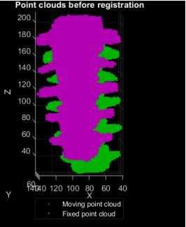

# Registration-of-Lumbar-Spine-Image
Lumbar Spine (L1-L5) Registration to Atlas Using Point Cloud Extraction and Coherent Point Drift Algorithm.
## Example of Results
Sample Data for Demonstration:

Spine data before registration:

Spine data after registration:

